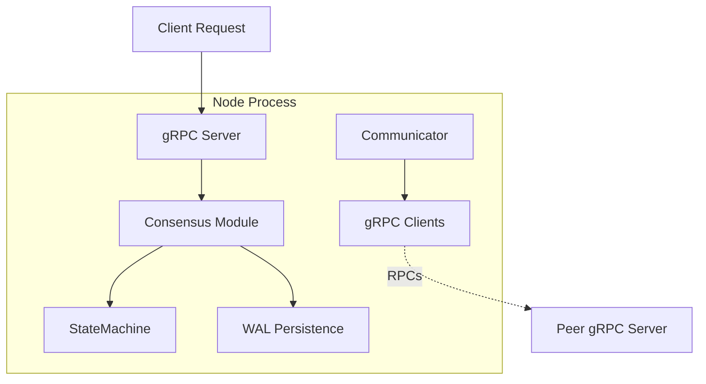

# System Architecture

This document describes the high-level architecture and data flow of the Distributed Consensus System.

## High-Level Architecture

The system is composed of multiple independent `Node` processes. Each node contains several layers:

## Communication Flow (Raft)

1. **Client Request**: Client sends a `SubmitCommand` to the Node.
2. **Leader Check**: If the node is not the leader, it rejects the request (optionally pointing to the known leader).
3. **Log Append**: The leader appends the command to its local log and writes to **WAL**.
4. **Replication**: Leader sends `AppendEntries` to all followers in parallel.
5. **Quorum Acknowledgement**: Once a majority (quorum) of followers acknowledge the entry, the leader marks it as **Committed**.
6. **Execution**: The leader applies the command to its **StateMachine** (KV store).
7. **Follower Execution**: On the next heartbeat/RPC, followers learn of the commit and apply it locally.

## Communication Flow (pBFT)

1. **Pre-Prepare**: Primary node receives a request, assigns a sequence number, and broadcasts it.
2. **Prepare**: Other nodes verify the request digest and broadcast their agreement.
3. **Commit**: Once a node hears 2f+1 "Prepare" messages, it broadcasts a "Commit".
4. **Execution**: Once a node hears 2f+1 "Commit" messages, it executes the command and returns the result.

## Network Simulation Layer

The system uses a middleware-like approach in the `Communicator` to simulate network failures:

1. A test script sends a `SetPartition` RPC to a node.
2. The node updates its `blocked_node_ids` list.
3. Every time the node tries to send an RPC, the `Communicator` checks if the target's ID is in the blocked list.
4. If blocked, the RPC is silently ignored (simulating a drop in packets).
